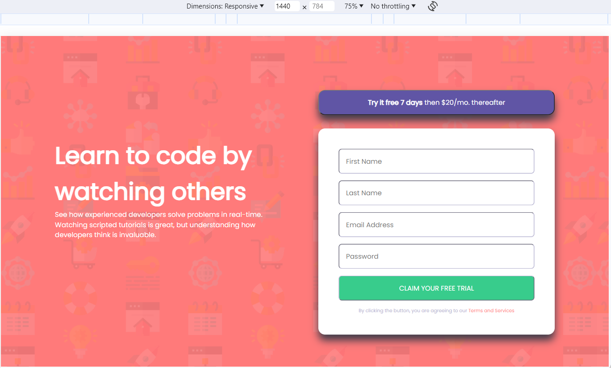
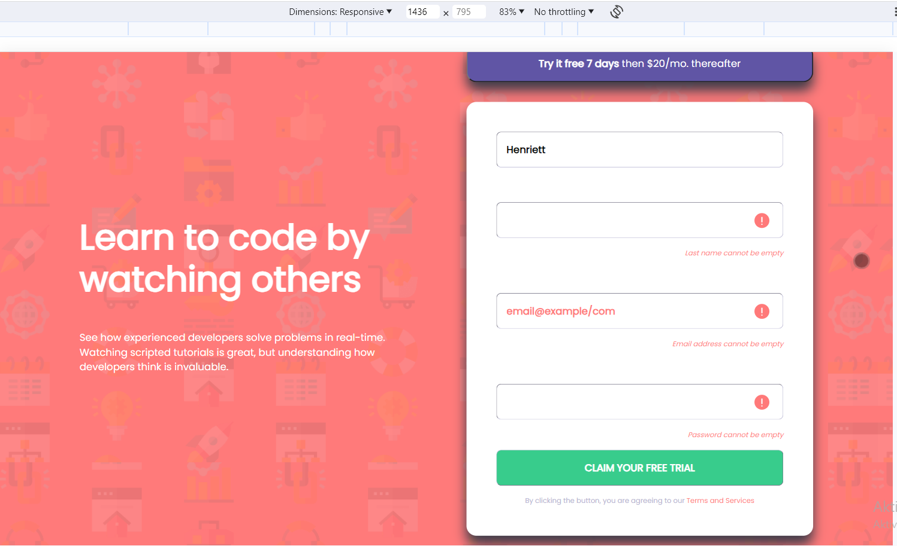
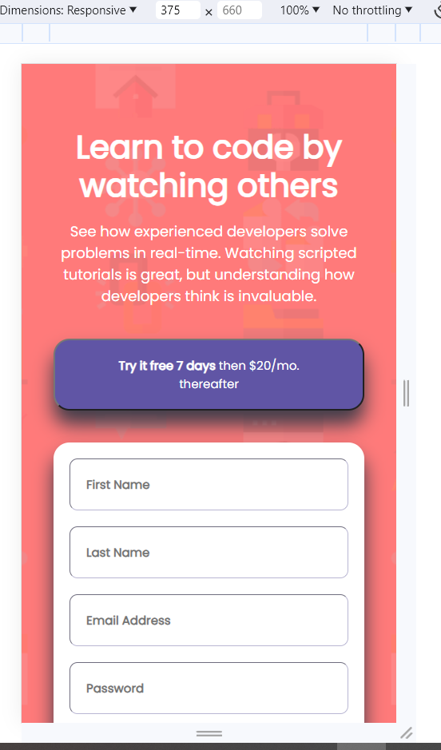

# Frontend Mentor - Intro component with sign up form solution

This is a solution to the [Intro component with sign up form challenge on Frontend Mentor](https://www.frontendmentor.io/challenges/intro-component-with-signup-form-5cf91bd49edda32581d28fd1). Frontend Mentor challenges help you improve your coding skills by building realistic projects. 

## Table of contents

- [Overview](#overview)
  - [The challenge](#the-challenge)
  - [Screenshot](#screenshot)
  - [Links](#links)
- [My process](#my-process)
  - [Built with](#built-with)
  - [What I learned](#what-i-learned)
  - [Continued development](#continued-development)
- [Author](#author)


**Note: Delete this note and update the table of contents based on what sections you keep.**

## Overview

### The challenge

Users should be able to:

- View the optimal layout for the site depending on their device's screen size
- See hover states for all interactive elements on the page
- Receive an error message when the `form` is submitted if:
  - Any `input` field is empty. The message for this error should say *"[Field Name] cannot be empty"*
  - The email address is not formatted correctly (i.e. a correct email address should have this structure: `name@host.tld`). The message for this error should say *"Looks like this is not an email"*

### Screenshot






### Links

- Solution URL: [Add solution URL here](https://github.com/Blanchevalen/Intro_Component_With_Signup_Form_Master_mini_project)
- Live Site URL: [Add live site URL here]([https://your-live-site-url.com](https://blanchevalen.github.io/Intro_Component_With_Signup_Form_Master_mini_project/))

## My process

### Built with

- Semantic HTML5 markup
- CSS custom properties
- CSS Grid
- Media query
- Simple Javascript code

**Note: These are just examples. Delete this note and replace the list above with your own choices**

### What I learned

**I learned using the input action is JavaScript, and cheking email address. I practice costum CSS, this is important for me, because i do not use a lot of things well. I met a new pseudo selector.**

To see how you can add code snippets, see below:

```css
.hiddenPlaceholder::placeholder{
    color:transparent;

}
```
```js
const proudOfThisFunc = () => {
  console.log('🎉')
}
```

If you want more help with writing markdown, we'd recommend checking out [The Markdown Guide](https://www.markdownguide.org/) to learn more.

### Continued development

Use this section to outline areas that you want to continue focusing on in future projects. These could be concepts you're still not completely comfortable with or techniques you found useful that you want to refine and perfect.

**Note: Unfortunatelly i don't allocate my time, but this project was shorter than previously. I want to do another newbie projects until, the working time and the quality will be appropriate.**


## Author


- Frontend Mentor - [@Blanchevalen](https://www.frontendmentor.io/profile/blanchevalen)


**Note: Delete this note and add/remove/edit lines above based on what links you'd like to share.**
